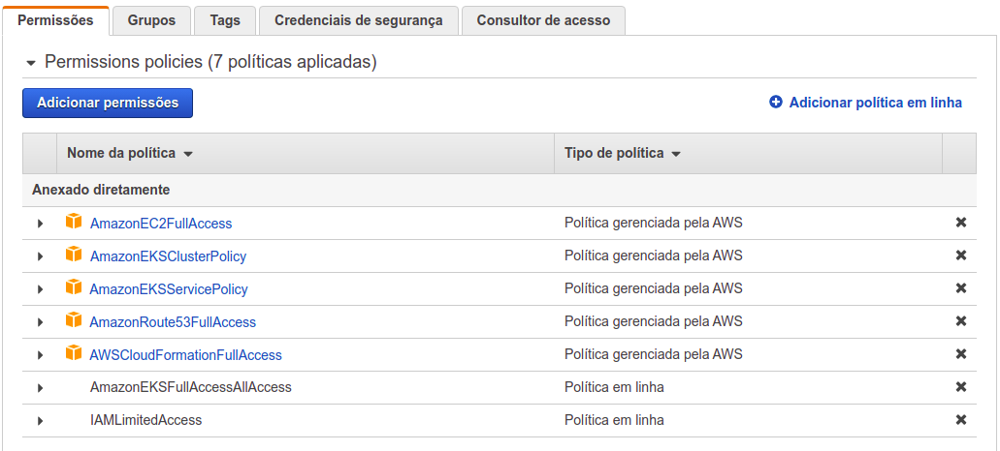
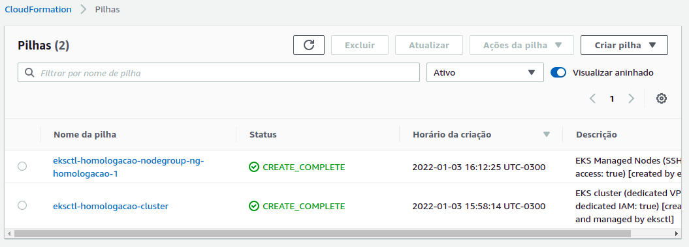
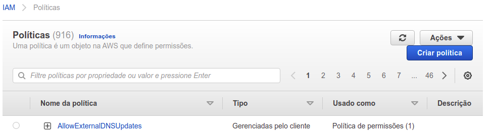
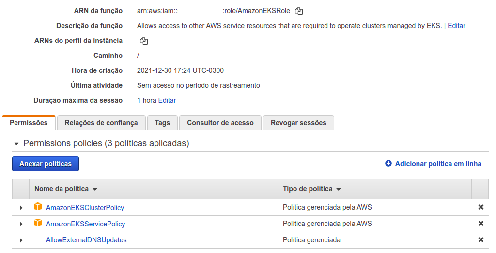
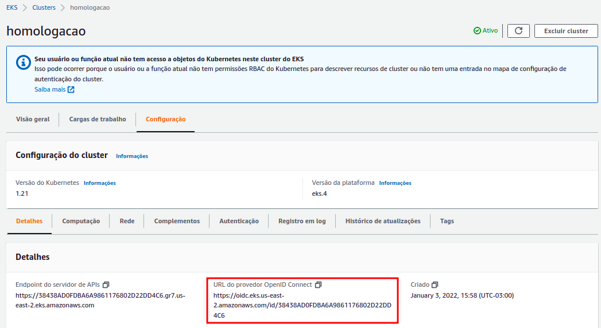
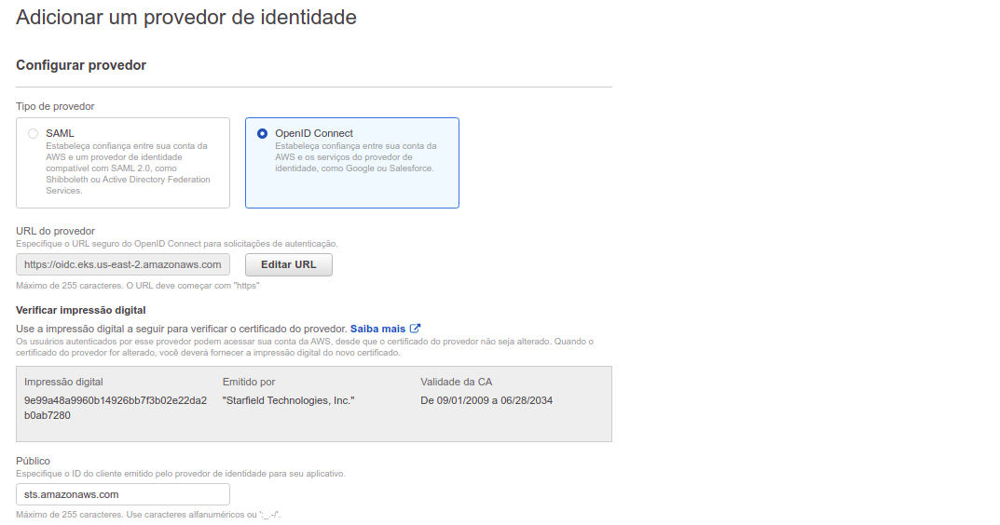
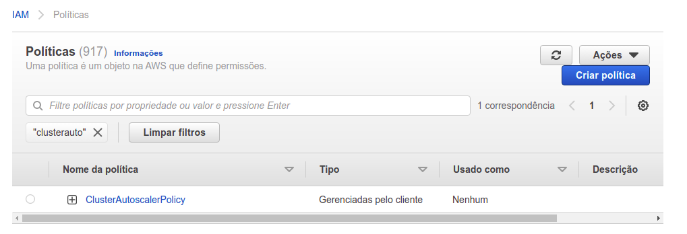

# Kubernetes - EKS

## Pré-requisitos

**AWSCLI**

A Interface da Linha de Comando (ILC) da AWS é uma ferramenta unificada para o gerenciamento de seus serviços da AWS. Com apenas uma ferramenta para fazer download e configurar, você poderá controlar vários serviços da AWS pela linha de comando e automatizá-los usando scripts.

*https://docs.aws.amazon.com/cli/latest/userguide/getting-started-install.html* 

**EKSCTL**

Utilitário de linha de comando simples para criar e gerenciar clusters de Kubernetes no Amazon EKS. O utilitário de linha de comando eksctl oferece a maneira mais rápida e fácil de criar um novo cluster com nós para o Amazon EKS.

*https://eksctl.io/introduction/#installation*

**HELM**

Helm é uma ferramenta de empacotamento de software livre que ajuda a instalar e gerenciar o ciclo de vida de aplicativos Kubernetes. Semelhante a gerenciadores de pacotes do Linux, como APT e Yum, o Helm é usado para gerenciar gráficos Kubernetes, que são pacotes de recursos de Kubernetes pré-configurados.

*https://helm.sh/docs/intro/install/*

## Credencial de acesso à AWS

Inicialmente foi criada uma credencial na AWS com todas políticas necessárias e uma role para a criação e administração do cluster EKS.

 

## Instalação do cluster EKS

Para a instalação do cluster foi criado um arquivo com os parâmetros necessários para iniciá-lo, este processo demora cerca de 20 minutos para finalizar.

\# *eksctl create cluster -f cluster.yml* 

Após a instalação são criadas duas stacks no CloudFormation, uma com as instruções de criação do cluster EKS e a outra para a craição do workers do cluster.

## Instalação do DNS External

ExternalDNS torna os recursos do Kubernetes detectáveis ​​por meio de servidores DNS públicos. Como o KubeDNS, ele recupera uma lista de recursos (serviços, entradas etc.) da API Kubernetes para determinar uma lista desejada de registros DNS. Ao contrário do KubeDNS, no entanto, não é um servidor DNS em si, mas apenas configura outros provedores de DNS de acordo, usando o AWS Route 53 por exemplo. Primeiramente é necessário criar uma política para permitir que a função do EKS possa atualizar as entradas no Route53 dinâmicamente.

Após configurar as permissões de políticas e roles, é criada a zona usada pelo cluster.

\# *aws route53 create-hosted-zone --name "homologacao.tallos.com.br." --caller-reference "external-dns-homologacao-$(date +%s)"*

Com a zona criada, o próxima passo é criar um iamRole para a serviceaccounte do cluster

\# *eksctl create iamserviceaccount \\ 
--name external-dns \\ 
--namespace default \\ 
--cluster homologacao \\ 
--attach-policy-arn arn:aws:iam::566854824552:policy/AllowExternalDNSUpdates \\ 
--approve*

Será informado um erro devido o IAM OIDC provider não está ativado, apenas executando os comandos retornados o problema é corrigido. 
Antes de criar o deploy do serviço do external-dns é necessário verificar o ID da zona que foi criada, pois a mesma é informada no arquivo yaml da criação do deploy.

\# *aws route53 list-hosted-zones* 
\# *kubectl create -f external-dns/external-dns.yml*

## Instalação do Cert Manager

Cert-Manager é um controlador usado para gerenciamento de certificados. Um gerenciador de certificados pode ajudar a emitir certificados de vários emissores, como Let’s Encrypt, HashiCorp Vault, Venafi, um par de chaves de assinatura simples ou autoassinado. O Cert-Manager valida os certificados, garante que eles sejam atualizados e renovados antes da expiração. Issuers, e ClusterIssuers são recursos do Kubernetes que representam autoridades de certificação (CAs) capazes de gerar certificados assinados honrando as solicitações de assinatura de certificado.

\# *helm repo add jetstack https://charts.jetstack.io* 
\# *helm repo update* 
\# *helm upgrade --install cert-manager jetstack/cert-manager \\ 
--namespace cert-manager \\ 
--create-namespace \\ 
--values "cert-manager/values.yml" \\ 
--wait* 
\# *kubectl create -f cert-manager/cert-issuer.yml* 
\# *kubectl get clusterissuers.cert-manager.io*

## Instalação do Prometheus Operator

O Prometheus Operator fornece implantação nativa do Kubernetes e gerenciamento do Prometheus e componentes de monitoramento relacionados. O objetivo deste projeto é simplificar e automatizar a configuração de uma pilha de monitoramento baseada no Prometheus para clusters Kubernetes.

\# *helm repo add prometheus-community https://prometheus-community.github.io/helm-charts* 
\# *helm repo update* 
\# *helm upgrade --install prometheus prometheus-community/kube-prometheus-stack \\ 
--namespace monitoring \\ 
--create-namespace \\ 
--values "monitoring/values.yml"*

## Instalação do Ingress Nginx

O Ingress é uma maneira de resumir um conjunto de serviços, semelhante a como um serviço abstrato de um conjunto de pods. Utilizando um conjunto de regras baseadas no pedido de hostname, ele é capaz de rotear tráfego de entrada para serviços internos do cluster.

\# *helm repo add ingress-nginx https://kubernetes.github.io/ingress-nginx* 
\# *helm repo update* 
\# *helm upgrade --install ingress-nginx ingress-nginx/ingress-nginx \\ 
--namespace ingress-nginx \\ 
--create-namespace \\ 
--set controller.metrics.enabled=true \\ 
--set-string controller.podAnnotations."prometheus\.io/scrape"="true" \\ 
--set-string controller.podAnnotations."prometheus\.io/port"="10254" \\ 
--set controller.service.externalTrafficPolicy=Local \\ 
--values "ingress-nginx/values.yml"* 
\# *helm get values ingress-nginx --namespace ingress-nginx*

Ativar a exportação das métricas do Ingress Nginx para o Prometheus:

\# *kubectl create -f ingress-nginx/servicemonitor.yml*

## Configuração do escalonamento automático do Cluster

O AWS Auto Scaling monitora os aplicativos e ajusta automaticamente a capacidade para manter um desempenho constante e previsível pelo menor custo possível. Com o AWS Auto Scaling, é fácil configurar a escalabilidade de aplicativos para vários recursos em diversos serviços em questão de minutos. 
Primeiramente é verificado o OpenID Connect do cluster, pois é necessário criar um provedor de identidade no IAM e a política que permite o escalonamento.

 

Criação do provedor de identidade:

 

Criação da política:

Foi criada uma função do IAM e anexada uma política do IAM a ela usando o eksctl.

\# *eksctl create iamserviceaccount \\ 
--cluster=homologacao \\ 
--namespace=kube-system \\ 
--name=cluster-autoscaler \\ 
--attach-policy-arn=arn:aws:iam::566854824552:policy/ClusterAutoscalerPolicy \\ 
--override-existing-serviceaccounts \\ 
--approve* 
\# *kubectl -n kube-system describe sa cluster-autoscaler*

Por fim é executada a implantação do Cluster Autoscaler. Na opção "--node-group-auto-discovery" do arquivo cluster-autoscaler-autodiscover.yaml é informado o nome do cluster no último parâmetro.

\# *kubectl create -f autoscaler/cluster-autoscaler-autodiscover.yml*

## Instalação do Metrics Server

O Metrics Server é uma fonte escalonável e eficiente de métricas de recursos de contêiner para pipelines de escalonamento automático integrados do Kubernetes.
O Metrics Server coleta métricas de recursos do Kubelets e as expõe no Kubernetes apiserver por meio da API Metrics para uso pelo Autoescalador Horizontal de Pod e Autoescalador de Pod Vertical. A API Metrics também pode ser acessada por kubectl top, facilitando a depuração de pipelines de escalonamento automático.

\# *helm repo add metrics-server https://kubernetes-sigs.github.io/metrics-server/* 
\# *helm repo update* 
\# *helm upgrade --install metrics-server metrics-server/metrics-server*